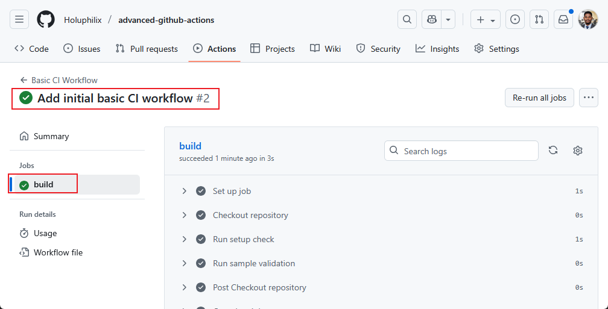
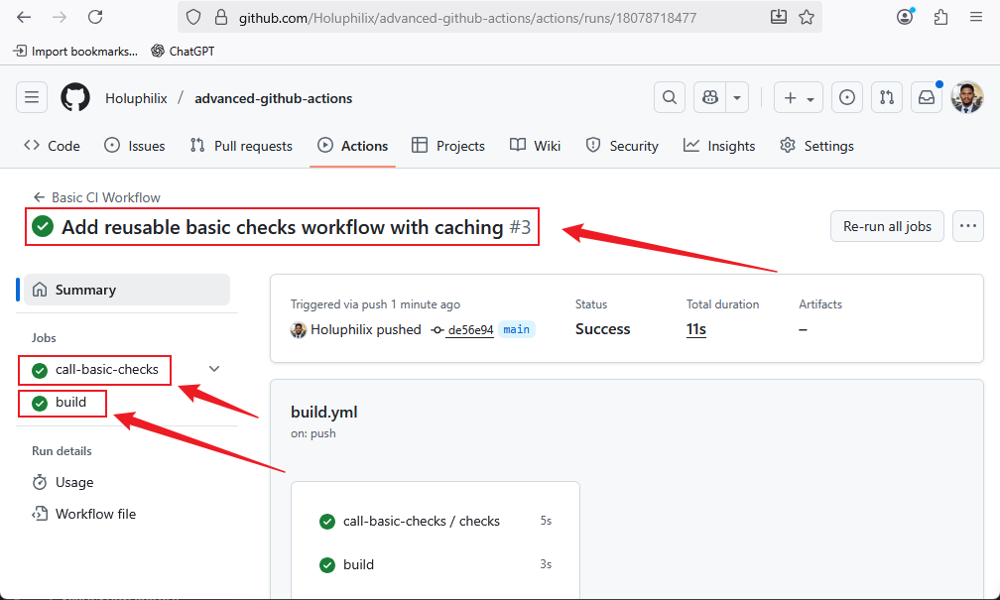
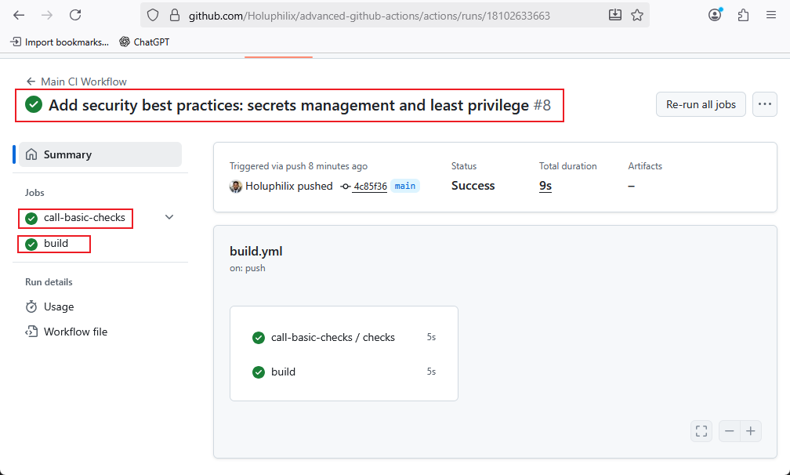
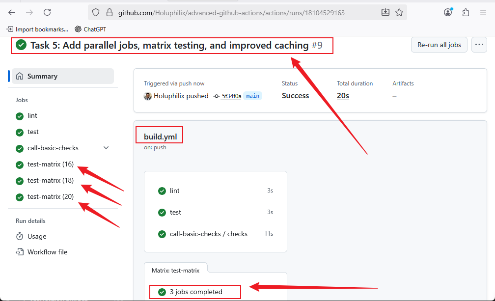

# **Advanced GitHub Actions and CI/CD Best Practices**

## **Project Overview**

This project focuses on mastering advanced GitHub Actions and CI/CD workflows. It emphasizes writing maintainable, efficient, and secure automation pipelines while optimizing performance and modularity for complex software projects.

## **Why is this Project Relevant**

As software projects grow in complexity, effective CI/CD pipelines become critical to ensure rapid, reliable, and secure deployments. This project equips developers with advanced skills to build robust and scalable workflows, improving productivity and software quality.

## **Project Goals and Objectives**

* Build maintainable and modular GitHub Actions workflows.
* Optimize workflow performance through caching and parallelization.
* Implement security best practices, including secrets management and least privilege principles.
* Gain hands-on experience in designing professional CI/CD pipelines for real-world projects.

## **Prerequisites**

* Basic knowledge of GitHub Actions and CI/CD concepts.
* Familiarity with Git, YAML, and command-line interface.
* Node.js or similar development environment (for demonstration workflows).

## **Project Deliverables**

* Fully structured project directory with necessary files.
* Reusable and maintainable workflow examples.
* Optimized and secure GitHub Actions pipelines.
* Documentation (README.md) with detailed instructions and best practices.

## **Tools & Technologies Used**

* **GitHub Actions** for CI/CD automation.
* **Git** for version control.
* **Node.js** or any target application environment for workflow testing.
* **YAML** for workflow configuration.
* **Text Editor/IDE** (VSCode recommended).

## **Project Components**

1. Project Directory and Sub-Directories
2. GitHub Actions Workflows (`.github/workflows`)
3. README.md Documentation
4. Images Folder (`images/`) for screenshots and diagrams
5. Modular and reusable workflow scripts

## **Task 1: Project Setup and Directory Structure**

### Objective

Create the root project directory, essential sub-directories, and initialize required files for workflow development and documentation.

### Steps

1. **Create Project Root Directory**

```bash
mkdir advanced-github-actions
cd advanced-github-actions
```

2. **Create Sub-Directories**

```bash
mkdir .github
mkdir .github/workflows
mkdir images
```

3. **Initialize Essential Files**

```bash
touch README.md
touch .gitignore
```

4. **Example `.gitignore` Entries**

```
node_modules/
*.log
.env
```

5. **Add Workflow Files**

Inside `.github/workflows/`, you will create the following workflow files during later tasks:

```
build.yml          # Main CI workflow (Tasks 2, 3, 5)
basic-checks.yml   # Reusable workflow with caching and secrets (Tasks 3, 4, 5)
```

6. **Verify Directory Structure**

```
advanced-github-actions/
├── .github/
│   └── workflows/
│       ├── build.yml
│       └── basic-checks.yml
├── images/
├── README.md
└── .gitignore
```

**Notes:**

* `.github/workflows/` contains all workflow files.
* `images/` can be used for screenshots or workflow diagrams.
* `README.md` will document all tasks (1–7) and workflow explanations.
* `.gitignore` ensures unnecessary files like `node_modules/`, logs, or `.env` are excluded from Git.

✅ **Task 1 Complete** – The project directory is fully prepared for workflow development and documentation.

## **Task 2: Create Initial GitHub Actions Workflow**

### Objective

Set up the first GitHub Actions workflow to demonstrate a **basic CI process**. This will serve as the foundation for building modular, maintainable, and secure pipelines throughout the project.

### Steps

1. **Create Workflow File**
   Inside the `.github/workflows` directory, create a file named `build.yml`:

```bash
cd .github/workflows
touch build.yml
```

2. **Define a Basic Workflow**
   Add the following content to `build.yml`:

```yaml
name: Basic CI Workflow

on:
  push:
    branches: [ main ]
  pull_request:
    branches: [ main ]

jobs:
  build:
    runs-on: ubuntu-latest

    steps:
    - name: Checkout repository
      uses: actions/checkout@v2

    - name: Run setup check
      run: echo "✅ Repository checked out successfully!"

    - name: Run sample validation
      run: echo "🚀 Basic CI workflow is running without Node.js dependencies."
```

3. **Workflow Explanation**

* **Triggers:** Runs automatically on `push` and `pull_request` to the `main` branch.
* **Jobs:**

  * `build` runs on the latest Ubuntu runner.
* **Steps:**

  1. **Checkout** – Retrieves the repository code.
  2. **Run setup check** – Verifies repository setup.
  3. **Run sample validation** – Executes a simple validation command (simulated test).

4. **git init, add, Commit and Push Workflow**

```bash
git init
git add .github/workflows/build.yml
git commit -m "Add initial basic CI workflow"
git branch -M main
git remote add origin https://github.com/Holuphilix/advanced-github-actions.git
git push -u origin main
```

5. **Verify Workflow**

* Go to your repository on GitHub.
* Navigate to the **Actions** tab.
* Confirm the workflow runs successfully when code is pushed or a pull request is created.

**Screenshot:** Basic CI Workflow


✅ **Task 2 Complete** – A working CI pipeline is now active and independent of Node.js.

## **Task 3: Modular Workflows with Reusable Workflow and Caching**

### Objective

Refactor the pipeline to use **reusable workflows** and implement **caching** for efficiency.

### Steps

1. **Create a Reusable Workflow**

   Create `.github/workflows/basic-checks.yml`:

   ```yaml
   name: Basic Checks Workflow

   on:
     workflow_call:
       secrets:
         ACCESS_TOKEN:
           required: true

   jobs:
     checks:
       runs-on: ubuntu-latest
       steps:
         - name: Checkout repository
           uses: actions/checkout@v2

         - name: Cache temp files
           uses: actions/cache@v3
           with:
             path: tmp-cache
             key: ${{ runner.os }}-basic-cache-${{ github.sha }}
             restore-keys: |
               ${{ runner.os }}-basic-cache-

         - name: Verify secret
           run: |
             if [ -z "${{ secrets.ACCESS_TOKEN }}" ]; then
               echo "❌ Secret is missing!"
               exit 1
             else
               echo "✅ Secret received successfully!"
             fi

         - name: Run setup check
           run: echo "✅ Repository checked out successfully!"

         - name: Run sample validation
           run: echo "🚀 Basic reusable workflow is running with caching enabled."
   ```

   **Explanation:**

   * `workflow_call` makes the workflow reusable.
   * `secrets.ACCESS_TOKEN` is required for security checks.
   * `actions/cache` speeds up builds by caching temporary files.

2. **Call the Reusable Workflow**

   Update `.github/workflows/build.yml`:

   ```yaml
   name: Main CI Workflow

   on:
     push:
       branches: [ main ]
     pull_request:
       branches: [ main ]

   jobs:
     call-basic-checks:
       uses: ./.github/workflows/basic-checks.yml
       secrets:
         ACCESS_TOKEN: ${{ secrets.ACCESS_TOKEN }}

     build:
       runs-on: ubuntu-latest
       steps:
         - name: Checkout repository
           uses: actions/checkout@v2

         - name: Run setup check
           run: echo "✅ Repository checked out successfully!"

         - name: Run sample validation
           run: echo "🚀 Basic CI workflow is running without Node.js dependencies."
   ```

   **Explanation:**

   * `call-basic-checks` job invokes the reusable workflow.
   * `secrets.ACCESS_TOKEN` is passed securely.
   * The `build` job runs additional validations.

3. **Commit and Push**

   ```bash
   git add .github/workflows/build.yml .github/workflows/basic-checks.yml
   git commit -m "Add reusable workflow and caching"
   git push origin main
   ```

**Screenshot:** Basic Checks Workflow


✅ **Task 3 Complete** – You now have a modular workflow setup with caching and secret validation.

## **Task 4: Security Best Practices in GitHub Actions**

### Objective

Enhance the pipeline’s security by properly managing secrets, applying least privilege, and monitoring workflow runs.

### Steps

1. **Store Secrets in GitHub**

   * Go to **Settings → Secrets and variables → Actions → New repository secret**.
   * Add:

     | Name         | Value               |
     | ------------ | ------------------- |
     | ACCESS_TOKEN | `your_secret_token` |

   **Explanation:**

   * Secrets are encrypted and not exposed in logs.
   * Never hardcode sensitive values in workflows.

2. **Use Secrets in Workflows**

   Your workflows already use:

   ```yaml
   secrets:
     ACCESS_TOKEN: ${{ secrets.ACCESS_TOKEN }}
   ```

   and in the reusable workflow:

   ```yaml
   on:
     workflow_call:
       secrets:
         ACCESS_TOKEN:
           required: true
   ```

   **Explanation:**

   * Secrets flow securely between workflows.
   * The `ACCESS_TOKEN` secret is verified before jobs proceed.

3. **Apply Least Privilege**

   * Go to **Settings → Actions → General → Workflow permissions**.
   * Select **Read repository contents permission** unless write access is required.

   **Explanation:**

   * Grants only what’s necessary.
   * Reduces potential attack surface.

4. **Audit and Monitor Workflow Runs**

   * Go to the **Actions** tab.
   * Regularly review workflow logs for unusual activity.
   * Enable **required reviews** for workflow changes if multiple collaborators exist.

   **Explanation:**

   * Detects misconfigurations or malicious code early.
   * Ensures accountability for workflow changes.

5. **Commit and Push Changes**

   (If you made modifications in this task)

   ```bash
   git add .github/workflows/build.yml .github/workflows/basic-checks.yml
   git commit -m "Implement security best practices in GitHub Actions"
   git push origin main
   ```

6. **Verify Implementation**

   * Ensure workflows run successfully.
   * Confirm secrets are received without being printed in logs.
   * Verify repository permissions are minimized.

**Screenshot:** Basic Checks Workflow Security Implementation


✅ **Task 4 Complete** – Your workflows now follow **GitHub Actions security best practices**.

## **Task 5: Performance Optimization with Parallel Jobs**

### Objective

Improve the efficiency and speed of your CI/CD pipelines by **running jobs in parallel**, **using job matrices**, and **optimizing caching**.

### Steps

1. **Implement Parallel Jobs**

   Modify your `.github/workflows/build.yml` to run multiple independent jobs at the same time:

   ```yaml
   name: Main CI Workflow

   on:
     push:
       branches: [ main ]
     pull_request:
       branches: [ main ]

   jobs:
     lint:
       runs-on: ubuntu-latest
       steps:
         - name: Checkout repository
           uses: actions/checkout@v2

         - name: Run linter
           run: echo "🔍 Running code linting..."
           # Replace with actual linter command if applicable

     test:
       runs-on: ubuntu-latest
       steps:
         - name: Checkout repository
           uses: actions/checkout@v2

         - name: Run tests
           run: echo "✅ Running unit tests..."
           # Replace with actual test command if applicable

     call-basic-checks:
       uses: ./.github/workflows/basic-checks.yml
       secrets:
         ACCESS_TOKEN: ${{ secrets.ACCESS_TOKEN }}
   ```

   **Explanation:**

   * `lint` and `test` jobs run **in parallel**.
   * `call-basic-checks` can run independently or sequentially depending on your needs.
   * Parallel execution reduces overall workflow runtime.

2. **Use a Job Matrix for Multiple Environments**

   If you want to test across multiple environments, implement a **matrix strategy**:

   ```yaml
   test-matrix:
     runs-on: ubuntu-latest
     strategy:
       matrix:
         node-version: [16, 18, 20]
     steps:
       - name: Checkout repository
         uses: actions/checkout@v2

       - name: Setup Node.js
         uses: actions/setup-node@v3
         with:
           node-version: ${{ matrix.node-version }}

       - name: Run tests
         run: echo "✅ Running tests on Node.js ${{ matrix.node-version }}"
         # Replace with actual test commands
   ```

   **Explanation:**

   * The job runs once for each Node.js version.
   * Ensures your project works across multiple runtime environments.
   * Saves setup time using caching.

3. **Optimize Caching**

   Make caching more effective by caching dependencies and build outputs:

   ```yaml
   - name: Cache Node modules
     uses: actions/cache@v3
     with:
       path: ~/.npm
       key: ${{ runner.os }}-node-${{ hashFiles('**/package-lock.json') }}
       restore-keys: |
         ${{ runner.os }}-node-
   ```

   **Explanation:**

   * Dependencies are restored quickly, avoiding repeated installs.
   * Cache key is based on `package-lock.json` to update only when dependencies change.

4. **Commit and Push Changes**

```bash
git add .github/workflows/build.yml
git commit -m "Task 5: Add parallel jobs, matrix testing, and improved caching"
git push origin main
```

5. **Verify in GitHub**

* Check that jobs run **in parallel**.
* Confirm matrix jobs execute for each environment.
* Ensure caching reduces execution time.

**Screenshot:** Add parallel jobs, matrix testing, and improved caching


✅ **Task 5 Complete** – Your CI/CD workflow is now **faster, more efficient**, and capable of handling multiple environments in parallel.

## **Task 6: Deployment and Notifications in GitHub Actions**

### Objective

Extend the CI/CD pipeline to **deploy artifacts** (e.g., to a staging server, Docker registry, or cloud service) and **notify team members** upon workflow completion, success, or failure.

### Steps

1. **Prepare Deployment Credentials**

   * Store deployment credentials as **GitHub Encrypted Secrets**:

     | Name        | Value                    |
     | ----------- | ------------------------ |
     | DEPLOY_USER | `your_ssh_username`      |
     | DEPLOY_HOST | `your_server_ip_or_host` |
     | DEPLOY_KEY  | `your_private_ssh_key`   |

   **Explanation:**

   * Secrets are used securely in workflows to avoid exposing sensitive information.

2. **Add Deployment Job in `build.yml`**

   Inside `.github/workflows/build.yml`, add a new job **after your test jobs**:

```yaml
  deploy:
    runs-on: ubuntu-latest
    needs: [lint, test, call-basic-checks] # Ensure deployment runs after checks
    steps:
      - name: Checkout repository
        uses: actions/checkout@v2

      - name: Set up SSH key
        run: |
          mkdir -p ~/.ssh
          echo "${{ secrets.DEPLOY_KEY }}" > ~/.ssh/id_rsa
          chmod 600 ~/.ssh/id_rsa

      - name: Add server to known_hosts
        run: ssh-keyscan -H ${{ secrets.DEPLOY_HOST }} >> ~/.ssh/known_hosts

      - name: Deploy to Server
        run: |
          ssh ${{ secrets.DEPLOY_USER }}@${{ secrets.DEPLOY_HOST }} "
          cd /path/to/deploy/directory &&
          git pull origin main &&
          ./deploy_script.sh
          "
```

**Explanation:**

* Uses SSH to securely deploy code to a remote server.
* `needs` ensures deployment only happens **after checks pass**.

3. **Add Notifications via Email or Slack**

   Example: Slack notification using `slackapi/slack-github-action`:

```yaml
  notify:
    runs-on: ubuntu-latest
    needs: deploy
    steps:
      - name: Send Slack Notification
        uses: slackapi/slack-github-action@v1.26.0
        with:
          channel-id: 'C0123456789'
          slack-token: ${{ secrets.SLACK_TOKEN }}
          text: "✅ Deployment completed successfully for commit ${{ github.sha }}"
```

**Explanation:**

* `needs: deploy` ensures notifications are sent **after deployment**.
* Secure token (`SLACK_TOKEN`) is stored in GitHub Secrets.

4. **Commit and Push Changes**

```bash
git add .github/workflows/build.yml
git commit -m "Task 6: Add deployment and notification jobs"
git push origin main
```

5. **Verify Deployment**

* Check Actions tab – ensure `deploy` job runs **after checks succeed**.
* Confirm code is deployed to the target server.
* Check Slack/email notifications are received.

✅ **Task 6 Complete** – CI/CD pipeline now includes **deployment** and **team notifications**, following secure best practices.

## **Task 7: Final Documentation, Repository Cleanup, and Push to GitHub**

### Objective

Prepare your project for public or team sharing by finalizing documentation, verifying workflow files, and pushing the complete project to GitHub.

### Steps

1. **Review Project Files**

   * Ensure all workflows (`build.yml`, `basic-checks.yml`) are correctly configured.
   * Confirm caching, reusable workflows, secrets, and deployment jobs are working.
   * Verify the `README.md` is complete with all tasks and instructions.

2. **Clean Up Project Directory**

   * Remove any unnecessary temporary files.
   * Ensure `.gitignore` covers `node_modules/`, logs, `.env`, or other sensitive files.

3. **Commit and Push Final Changes**

```bash
git add .
git commit -m "Final project: Complete workflows and documentation"
git push origin main
```

4. **Verify Repository on GitHub**

   * Go to your GitHub repository.
   * Ensure that all files and directories are present.
   * Check that workflows are listed under **Actions** and run correctly.

✅ **Task 7 Complete** – Project fully documented, cleaned, and deployed on GitHub.

## **Conclusion**

This project demonstrated **advanced GitHub Actions concepts** including:

* Modular and reusable workflows to reduce duplication.
* Caching and parallel jobs to optimize workflow performance.
* Secure handling of secrets and application of the least privilege principle.
* Monitoring, auditing, and deploying workflows reliably.

By completing these tasks, you have created a **robust, maintainable, and secure CI/CD pipeline** that can scale for real-world software projects.

## **Author**

### **Philip Oluwaseyi Oludolamu**
* **Email:** [oluphilix@gmail.com](mailto:oluphilix@gmail.com)
* **GitHub:** [github.com/Holuphilix](https://github.com/Holuphilix)
* **LinkedIn:** [linkedin.com/in/philipoludolamu](https://linkedin.com/in/philipoludolamu)
* **Phone:** +905338763067

